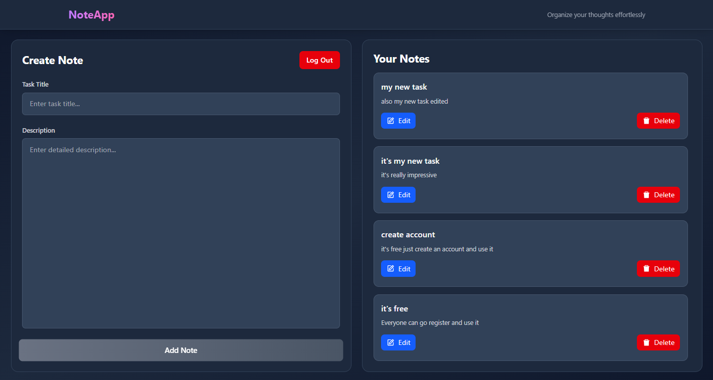

<div align="center">

# 📝 NotAppia

### A secure, full-stack notes app where your data is yours alone.

[](https://not-appia-frontend.vercel.app/)
[](https://github.com/MuhammadAhmadCode/NotAppia-Backend)
[](https://github.com/MuhammadAhmadCode/NotAppia-Frontend)

</div>

---

## 🎬 Demo

<div align="center">



</div>

---

## ✨ Features

| Feature             | Description                                   |
| ------------------- | --------------------------------------------- |
| 🔐 Secure Auth      | JWT tokens stored in httpOnly cookies         |
| 🔒 Password Safety  | bcrypt hashing — plain passwords never stored |
| 🛡️ Protected Routes | Middleware blocks unauthenticated requests    |
| 👤 User Isolation   | Users can only access their own notes         |
| ✅ Input Validation | express-validator on all routes               |
| 📝 Full CRUD        | Create, read, update, delete notes            |

---

## 🛠️ Tech Stack

<div align="center">


</div>

---

## 🔌 API Routes

### 🔑 Auth Routes

| Method | Route                | Description             |
| ------ | -------------------- | ----------------------- |
| `POST` | `/api/auth/register` | Register a new user     |
| `POST` | `/api/auth/login`    | Login and receive token |
| `GET`  | `/api/auth/me`       | Get current user        |
| `POST` | `/api/auth/logout`   | Clear auth cookie       |

### 📝 Notes Routes

| Method   | Route            | Description            |
| -------- | ---------------- | ---------------------- |
| `GET`    | `/api/notes`     | Get all notes for user |
| `POST`   | `/api/notes`     | Create a new note      |
| `PATCH`  | `/api/notes/:id` | Update a note          |
| `DELETE` | `/api/notes/:id` | Delete a note          |

---

## 🚀 Local Setup

```bash
# 1. Clone the repo
git clone https://github.com/MuhammadAhmadCode/NotAppia-Backend.git

# 2. Install dependencies
npm install

# 3. Create .env file
PORT=3000
MONGO_URI=your_mongodb_connection
JWT_SECRET=your_secret_key
Frontend_URI=your_react_app_uri

# 4. Start the server
npm run dev
```

---

## 💡 What I Learned

- 🔐 How JWT auth works under the hood and why httpOnly
  cookies beat localStorage for token storage
- 🛡️ Why backend validation is non-negotiable — anyone
  can bypass a React form with Postman
- 🏗️ How to structure Express middleware for clean,
  reusable, and scalable code

---

<div align="center">

_Made by M. Ahmad with 💝 and 🍵_

</div>
